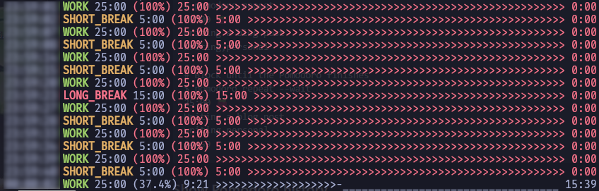

# tmr -- CLI Timer with Pomodoro timer

ターミナル上で動作する、効率的でカスタマイズ可能なタイマーです。
単純なタイマー機能と、ポモドーロ・タイマー機能があります。




## == 特徴
- **TUIによる進捗表示**: プログレスバーで残り時間を視覚的に把握できます。
- **レスポンシブ対応**: ターミナルのサイズが変化したらリアルタイムに追従します。画面幅が狭いと、表示項目を省き、画面が崩れないようにします。
- **カスタマイズ可能**: 作業時間、休憩時間、サイクル数を自由に変更できます。
- **柔軟な機能**: タイマー動作中に時間を進めたり、戻ししたり、ポーズしたりできます。


## == Requirement

- mise: 開発用パッケージ管理
- uv: Pythonプロジェクト管理


## == Install

```bash
git clone https://github.com/ytani01/tmr.git
cd tmr

mise trust
mise run build

uv tool install -U .
```


## == Usage

### === 共通

ポモドーロタイマーでは、quitすると次のフェーズに移ります。
ポモドーロタイマーを終了する場合は、強制終了してください。

- **quit**: [q], [ESC]
- **強制終了**: [Ctrl]+[C]
- **pause**: [p], [SPACE], [ENTER]
- **forward 1 second**: "+", [RIGHT], [Ctrl]+[F]
- **forward 10 seconds**: [DOWN], [Ctrl]+[N]
- **backward 1 second**: "-", [LEFT], [Ctrl]+[B]
- **backwawrd 10 seconds**: [UP], [Ctrl]+[P]
- **clear terminal**: [Ctrl]+[L]


```bash
uv run tmr --help

Usage: tmr [OPTIONS] COMMAND [ARGS]...

  Cli.

Options:
  -V, -v, --version  Show the version and exit.
  -d, --debug        debug flag
  -h, --help         Show this message and exit.

Commands:
  p         Pomodoro Timer.
  pomodoro  Pomodoro Timer.
  t         Simple Timer.
  timer     Simple Timer.
```

### === subcommand: ``timer`` or ``t``

```bash
uv run tmr timer --help

Usage: tmr timer [OPTIONS] MINUTES

  Simple Timer.

Options:
  -c, --alarm-count INTEGER  alarm count  [default: 999]
  --alarm-sec1, --s1 FLOAT   alarm sec1  [default: 0.5]
  --alarm-sec2, --s2 FLOAT   alarm sec2  [default: 1.5]
  -V, -v, --version          Show the version and exit.
  -d, --debug                debug flag
  -h, --help                 Show this message and exit.
```

### === subcommand: ``pomodoro`` or ``p``

```bash
uv run tmr pomodoro --help

Usage: tmr pomodoro [OPTIONS]

  Pomodoro Timer.

Options:
  -w, --work-time FLOAT        working time  [default: 25.0]
  -b, --break-time FLOAT       break time  [default: 5.0]
  -l, --long-break-time FLOAT  long break time  [default: 15.0]
  -c, --cycles INTEGER         cycles  [default: 4]
  -V, -v, --version            Show the version and exit.
  -d, --debug                  debug flag
  -h, --help                   Show this message and exit.
```

---
(c) 2026 Yoichi Tanibayashi
