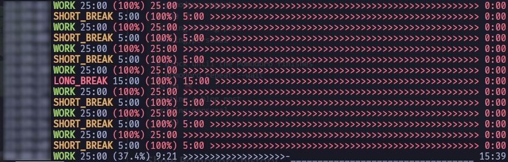

# tmr -- CLI Timer with Pomodoro timer

ターミナル上で動作する、効率的でカスタマイズ可能なタイマーです。
単純なタイマー機能と、ポモドーロ・タイマー機能があります。




## == 特徴
- **プログレスバーによる進捗表示**: 残り時間を視覚的に把握できます。
- **レスポンシブ対応**: ターミナルのサイズが変化すると、リアルタイムに追従します。画面幅が狭い場合は、表示項目を省き、表示が崩れないようにします。
- **カスタマイズ可能**: 作業時間、休憩時間、サイクル数を自由に変更できます。
- **柔軟な機能**: タイマー動作中に時間を進めたり、戻したり、ポーズしたりできます。


## == Requirement

- mise: 開発用パッケージ管理
- uv: Pythonプロジェクト管理
- Python 3.13+

## == Install

```bash
git clone https://github.com/ytani01/tmr.git
cd tmr

mise trust
mise run build

uv tool install -U .
```


## == Usage

### === 共通

ポモドーロタイマーでは、quitすると次のフェーズに移ります。
ポモドーロタイマーを終了する場合は、強制終了してください。

```
COMMAND LIST
  [P], [SPACE]                            : Pause timer.
  [←], [Ctrl]+[B], [H], [-], [BACKSPACE]  : Backward 1 second.
  [→], [Ctrl]+[F], [L], [+], [=]          : Forward 1 second.
  [↑], [Ctrl]+[P], [K]                    : Backward 10 seconds.
  [↓], [Ctrl]+[N], [J]                    : Forward 10 seconds.
  [Ctrl]+[L]                              : Clear terminal.
  [N], [ENTER]                            : Next.
  [Q], [ESCAPE]                           : Quit.
  [?]                                     : Help.
```


```bash
Usage: tmr [OPTIONS] COMMAND [ARGS]...

  Timer CLI.

Options:
  -V, -v, --version  Show the version and exit.
  -d, --debug        debug flag
  -h, --help         Show this message and exit.

Commands:
  p         Pomodoro Timer.
  pomodoro  Pomodoro Timer.
  t         Simple Timer.
  timer     Simple Timer.
```

### === subcommand: ``timer`` or ``t``

```bash
uv run tmr timer --help

Usage: tmr timer [OPTIONS] MINUTES

  Simple Timer.

Options:
  -t, --title TEXT                alarm title  [default: Timer]
  -c, --title-color, --color TEXT
                                  title color  [default: blue]
  --alarm-count INTEGER RANGE     alarm count  [default: 999; x>=0]
  --alarm-sec1, --s1 FLOAT RANGE  alarm sec1  [default: 0.5; 0<=x<=86400]
  --alarm-sec2, --s2 FLOAT RANGE  alarm sec2  [default: 1.5; 0<=x<=86400]
  -V, -v, --version               Show the version and exit.
  -d, --debug                     debug flag
  -h, --help                      Show this message and exit.
```

### === subcommand: ``pomodoro`` or ``p``

```bash
uv run tmr pomodoro --help

Usage: tmr pomodoro [OPTIONS]

  Pomodoro Timer.

Options:
  -w, --work-time FLOAT RANGE     working time  [default: 25.0; x>0]
  -b, --break-time FLOAT RANGE    break time  [default: 5.0; x>0]
  -l, --long-break-time FLOAT RANGE
                                  long break time  [default: 15.0; x>0]
  -c, --cycles INTEGER RANGE      cycles  [default: 4; x>=1]
  -V, -v, --version               Show the version and exit.
  -d, --debug                     debug flag
  -h, --help                      Show this message and exit.
```


## == 設定ファイル

よく使う値を `~/.config/tmr/config.toml` に書いておけます
（`XDG_CONFIG_HOME` があればそちらの下）。

```toml
debug = true          # tmr 自身のオプション

[timer]
minutes = 5
title = "Work"
title-color = "green"

[pomodoro]
work-time = 25.0
break-time = 5.0
cycles = 4
```

- セクション名はサブコマンドの名前（別名の `t` / `p` ではなく
  `timer` / `pomodoro`）
- キーは長い方のオプション名から `--` を取ったもの。
  `title_color` のようにアンダースコアで書いても構いません
- `timer` の `minutes` は引数ですが、これも書けます。
  書いておくと `tmr timer` だけで起動できます
- 優先順位は **コマンドライン引数 > 設定ファイル > 既定値**
- ファイルが無ければ、何も言わずに既定値を使います。
  **TOML が壊れている・知らないセクションやキーがある場合は、
  エラーを出して終了します**

---
(c) 2026 Yoichi Tanibayashi
