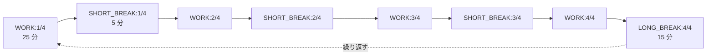

# tmr -- CLI Timer with Pomodoro timer

ターミナルで動く CLI タイマーです。
単純なタイマーと、ポモドーロタイマーの 2 つがあります。


## == 特徴

- **プログレスバーで進捗が見える**: 残り時間を一目で把握できます。
- **端末の幅に追従する**: 幅が変わると表示も変わります。狭いときは
  重要でない項目から自動的に省き、表示が崩れません。
- **時間とサイクルを自由に決められる**: 作業時間、休憩時間、
  サイクル数を指定できます。
- **動作中に操作できる**: 早送り、巻き戻し、ポーズができます。
- **設定ファイルに既定値を書ける**: よく使う値は
  `~/.config/tmr/config.toml` に置けます。


## == ポモドーロタイマー

作業と休憩を決まった長さで繰り返す時間管理の方法です。
`tmr pomodoro` は、次の順にフェーズを進めます。


```mermaid
flowchart LR
    W1["WORK:1/4<br/>25 分"] --> B1["SHORT_BREAK:1/4<br/>5 分"]
    B1 --> W2["WORK:2/4"] --> B2["SHORT_BREAK:2/4"]
    B2 --> W3["WORK:3/4"] --> B3["SHORT_BREAK:3/4"]
    B3 --> W4["WORK:4/4"] --> LB["LONG_BREAK:4/4<br/>15 分"]
    LB -. "繰り返す" .-> W1
```

長い休憩までの作業回数は `-c`（既定は 4）で変えられます。
フェーズは自動で進み、`[Q]` を押すまで繰り返します。
`[N]` を押せば、途中でも次のフェーズへ進めます。


## == Requirement

- mise: 開発用パッケージ管理
- uv: Python プロジェクト管理
- Python 3.13+


## == Install

```bash
git clone https://github.com/ytani01/tmr.git
cd tmr

mise trust
mise run build

uv tool install -U .
```


## == 使ってみる

5 分の単純タイマー:

```bash
tmr timer 5
```

既定の設定（作業 25 分 / 休憩 5 分 / 長い休憩 15 分 / 4 サイクル）で
ポモドーロタイマー:

```bash
tmr pomodoro
```

どちらも、動作中に `[?]` を押すとキー操作の一覧が出ます。
`[Q]` で終了します。


## == ドキュメント

- [使い方 (docs/User.md)](docs/User.md) —
  オプション、キー操作、画面の見方、アラーム、設定ファイル
- [開発者向け (docs/Developer.md)](docs/Developer.md) —
  モジュール構成、設計の意図、テスト、開発コマンド

---
(c) 2026 Yoichi Tanibayashi
