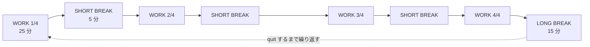
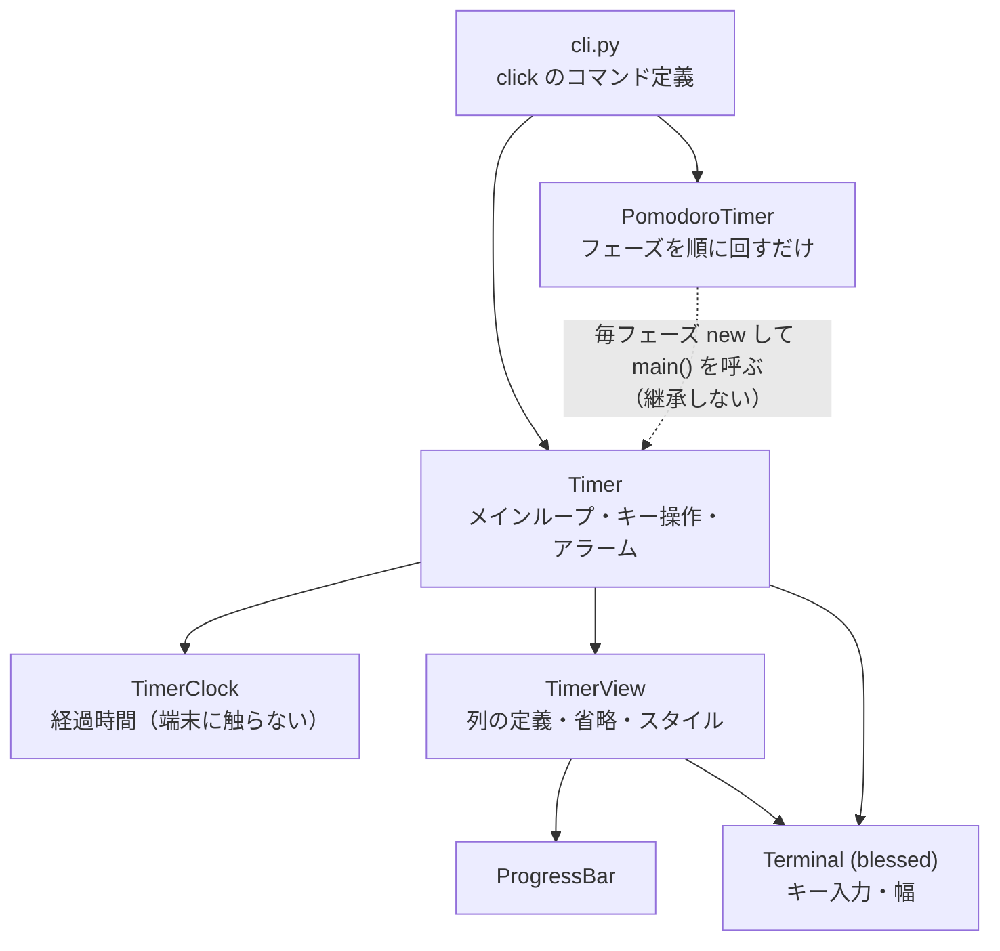
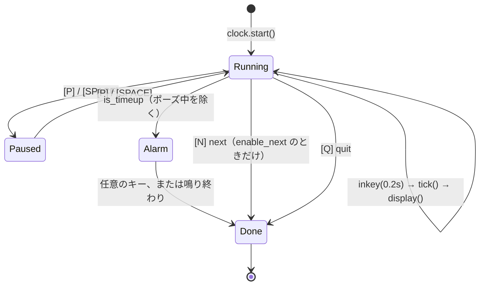
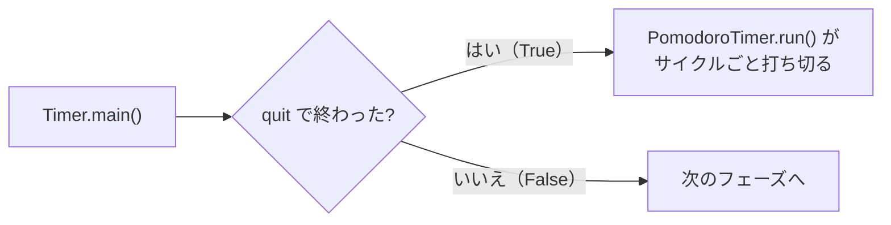
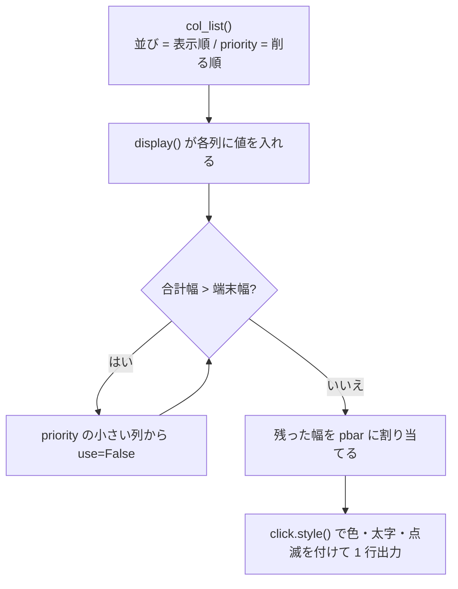

# TODO-015 構成と図の設計（main）

3 文書の役割分担と、各文書に入れる図の設計。`implementer` はこれに沿って書く。

## 役割分担（重複を無くすための線引き）

| 文書 | 読み手 | 書くこと | 書かないこと |
|---|---|---|---|
| `README.md` | 初めて見る人 | 何ができるか、特徴、インストール、最小の使用例、2 文書への導線 | help 出力の全文、設定ファイルの詳細、キー操作の全一覧 |
| `docs/User.md` | 使う人 | 起動方法、`timer` / `pomodoro` の全オプション、キー操作、画面の見方、幅による省略、設定ファイル、アラーム | 内部構造、クラス名、テスト |
| `docs/Developer.md` | 手を入れる人 | モジュール構成、クラス分割の理由、`col_list()` と `priority`、フェーズ制御、`mylog` の規約、テストの patch 先、開発コマンド | 利用者向けの操作説明（`User.md` へリンク） |

- `README.md` の「COMMAND LIST」「各サブコマンドの help 出力」「設定ファイル」の節は
  **`docs/User.md` へ移す**（README には残さない）。
- `CLAUDE.md` は Claude 向けの規約なので、`Developer.md` と内容が重なっても
  今回は触らない。`Developer.md` は人間向けに「なぜそうなっているか」を書く。

## 事実確認（2026-09-08 時点のコードで確認済み）

- `README.md` の「ポモドーロタイマーでは、quit すると次のフェーズに移ります。
  終了する場合は強制終了してください」は**誤り**。
  - `[N]` / `[ENTER]`（next）が次のフェーズへ進む。ポモドーロでだけ有効
    （`enable_next=True`）。単純タイマーの help には出ない。
  - `[Q]` / `[ESC]`（quit）はポモドーロ全体を終わらせる。強制終了は要らない。
  - 正しく書き直すこと。
- `phases()` は**無限に**フェーズを返す。`--cycles 4` は
  「WORK 4 回で LONG BREAK」という 1 巡の長さで、quit するまで巡り続ける。
- `tmr --help` / `tmr timer --help` / `tmr pomodoro --help` の出力は、
  現 README に載っているものと一致している（そのまま `User.md` へ移してよい）。
- 表示項目の順と `priority`（`view.py` の `col_list()`）:

  | 表示順 | name | priority | 中身 |
  |---|---|---|---|
  | 1 | `date` | 1 | `2026-09-08` |
  | 2 | `time` | 2 | `14:03:21` |
  | 3 | `title` | 8 | `-t` で指定した題（太字） |
  | 4 | `limit` | 5 | 設定時間 `25m` |
  | 5 | `state` | 7 | `[PAUSE]` / `[TIME UP]`。それ以外は空 |
  | 6 | `rate` | 4 | ` 42.0%` |
  | 7 | `elapsed` | 3 | 経過 `10m30s` |
  | 8 | `pbar` | 6 | プログレスバー（残り幅を全部使う） |
  | 9 | `remain` | 9 | 残り `14m30s` |

  `priority` が**小さいものから削られる**ので、最後まで残るのは `remain`、
  次が `title`、その次が `state`。最初に消えるのは `date`。

## 図の設計

mermaid が基本。画面の並びだけ枠線付きのテキスト図にする。

### 図 1 — `README.md`: ポモドーロのサイクル



図の下に 1〜2 行だけ添える（`-c` で 4 の部分が変わること、`[Q]` で終わること）。

### 図 2 — `docs/User.md`: 画面の各項目

枠線付きのテキスト図。1 行の実例を示し、下に指示線で名前を振る。

```
 ┌────────────────────────────────────────────────────────────────────┐
 │ 2026-09-08 14:03:21 Timer  25m  42.0% 10m30s >>>>>>>>/______ 14m30s │
 └────────────────────────────────────────────────────────────────────┘
   │          │        │     │     │     │      │              │
   │          │        │     │     │     │      │              └ remain  残り時間
   │          │        │     │     │     │      └ pbar     進捗（末尾は動く風車）
   │          │        │     │     │     └ elapsed              経過時間
   │          │        │     │     └ rate                       経過率
   │          │        │     └ limit                            設定時間
   │          │        └ title              -t で指定した題（-c で色）
   │          └ time                                            現在時刻
   └ date                                                       今日の日付
```

- 別に `state` の説明を添える（`title` と `limit` の間に、ポーズ中は
  `[PAUSE]`、満了して鳴っている間は `[TIME UP]` が点滅で入る）。
- 経過率に応じて色が変わること（80% 以上で黄、95% 以上で赤）も添える。

### 図 3 — `docs/User.md`: 幅が狭いときに落ちていく様子

同じくテキスト図。幅を段階的に狭めた 3〜4 行を並べる。

```
 幅 80 ┃ 2026-09-08 14:03:21 Timer  25m  42.0% 10m30s >>>>/____ 14m30s
 幅 60 ┃ 14:03:21 Timer  25m  42.0% 10m30s >>>>>>/_______ 14m30s
 幅 40 ┃ Timer  25m  42.0% >>>>>>>>/____ 14m30s
 幅 25 ┃ Timer >>>>>>>>>>/__ 14m30s
        ↑ date → time → elapsed → rate → limit の順に消えていく
```

（実例の桁は `implementer` が実際に端末幅を変えて動かし、実物に合わせること。
`stty cols NN` で幅を変えて `uv run tmr timer 1` を短く動かすか、
`TimerView.display()` を直接呼んで確かめる。）

削られる順の一覧も表で示す:
`date`(1) → `time`(2) → `elapsed`(3) → `rate`(4) → `limit`(5) → `pbar`(6) →
`state`(7) → `title`(8) → `remain`(9)。

### 図 4 — `docs/Developer.md`: クラス構成



継承しない理由（`PomodoroTimer` は `Timer` の「使い手」であって
「特殊な `Timer`」ではない）を、図の下に散文で 3〜4 行。

### 図 5 — `docs/Developer.md`: `Timer.main()` のループとフェーズ制御



その下に、戻り値による制御を別の図で:



「`next` はタイマーを終わらせるが `True` を返さない。この 1 点だけが
ポモドーロの制御経路」と明記する。

### 図 6 — `docs/Developer.md`: `col_list()` から表示が決まる流れ



「表示項目を足すときは `col_list()` に 1 行足し、`display()` で値を入れる」
の手順を、この図の後に書く。

## 各文書の節構成

### README.md
1. タイトルと 2〜3 行の紹介
2. ``
3. 特徴（既存の 4 点を活かす）
4. ポモドーロとは / サイクル図（図 1）
5. Requirement
6. Install
7. 使ってみる（`tmr timer 5` と `tmr pomodoro` の 2 例だけ。`[?]` でヘルプ）
8. ドキュメント（`docs/User.md` / `docs/Developer.md` への導線）
9. ライセンス表記

### docs/User.md
1. インストールと起動
2. 単純タイマー `tmr timer`（help 出力、使用例）
3. ポモドーロ `tmr pomodoro`（help 出力、使用例、フェーズの進み方と `[N]` / `[Q]`）
4. キー操作（`[?]` の COMMAND LIST。`[N]` はポモドーロだけである旨）
5. 画面の見方（図 2）
6. 端末の幅が狭いとき（図 3）
7. アラーム（`--alarm-count` / `--s1` / `--s2`、0 で鳴らせない、任意キーで止まる）
8. 設定ファイル（現 README の節をそのまま移し、必要なら補う）

### docs/Developer.md
1. 開発環境（`uv run pytest tests` / lint 4 本 / 行長 78 / `mise run` の注意）
2. モジュール構成（図 4 と各ファイルの 1 行説明）
3. なぜ 3 つに分けたか（`TimerClock` / `TimerView` / `Timer`）
4. `PomodoroTimer` が継承しない理由
5. メインループとフェーズ制御（図 5）
6. 表示の決まり方（図 6、`priority` の表、項目の足し方）
7. 時刻の扱い（`time.monotonic()`、`t_start` をずらす）
8. ログの規約（`mylog` / `__qualname__` / `loggerInit()`）
9. 設定ファイルの読み込み（`ConfigGroup` と `default_map`）
10. テスト（patch 先の表、`term.width` に数値を入れる注意）
11. バージョン（`hatch-vcs`）

## 書き方の注意

- `~/.claude/CLAUDE.md` の日本語の書き方に従う（簡潔に、直訳調にしない、
  造語を作らない、IT 用語は普通のカタカナか英語のまま）。
- 3 文書で同じことを 2 度書かない。重なる話はどれか 1 つに書き、
  他からはリンクする。
- コマンド例と help 出力は、**実際に動かして貼る**（`uv run tmr ... --help`）。
- mermaid は GitHub で描画されるので、構文が通ることを確かめる。
