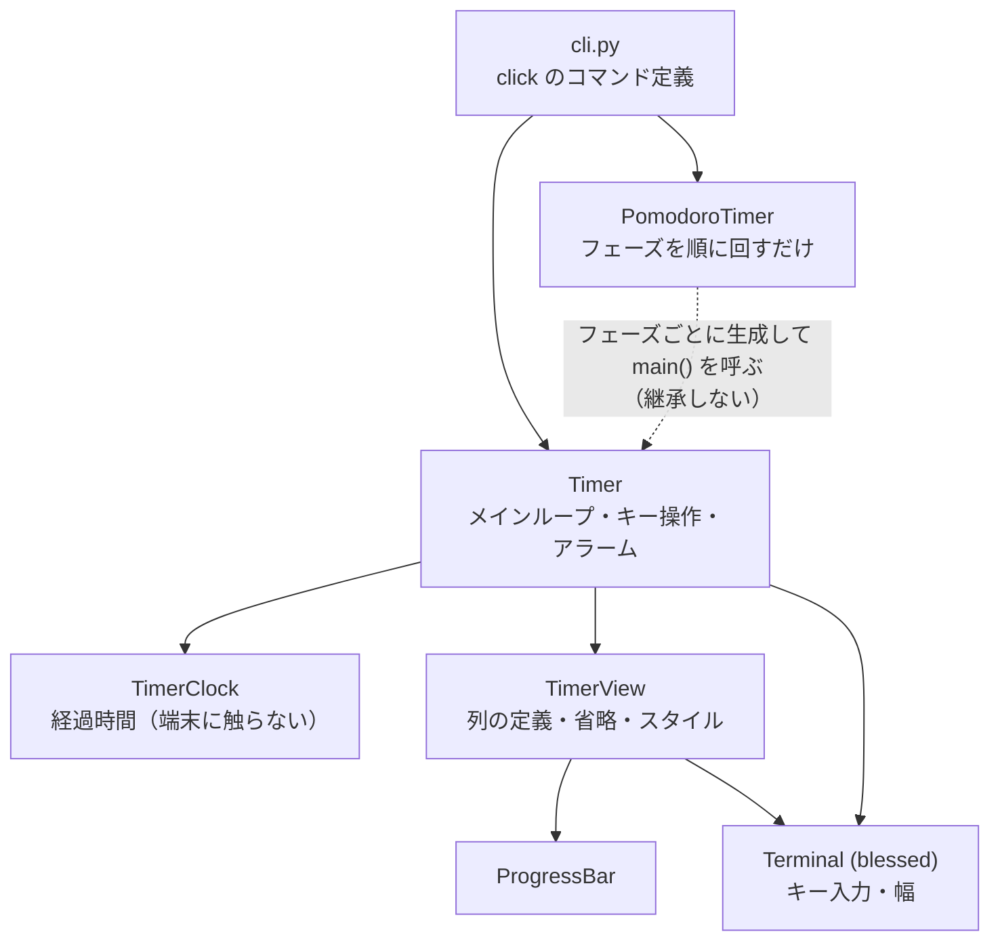
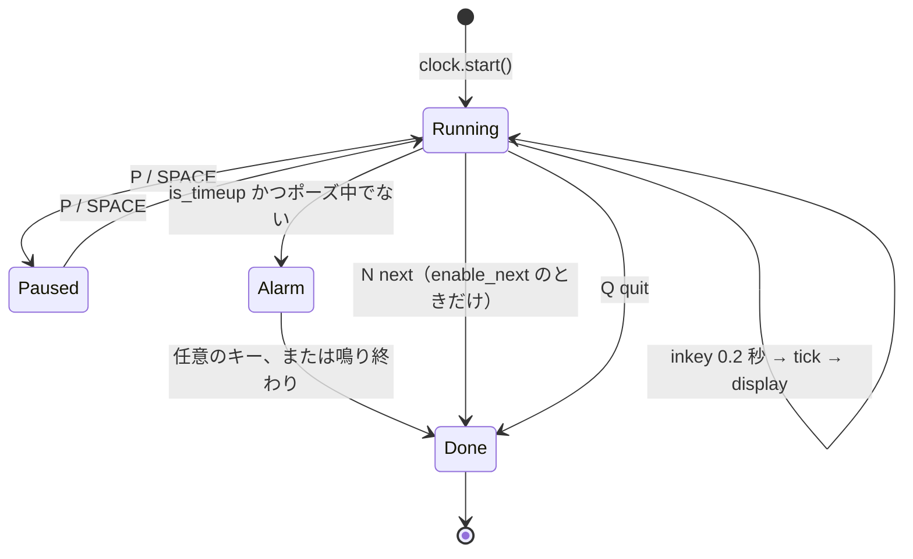
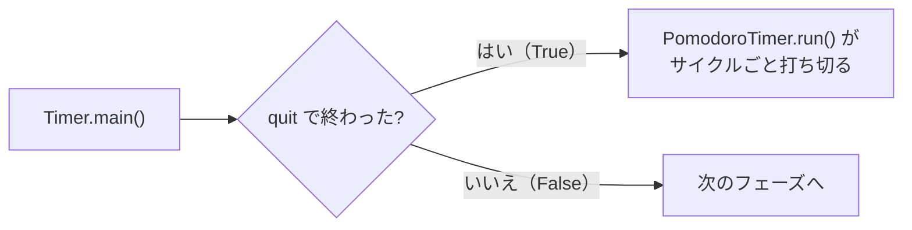
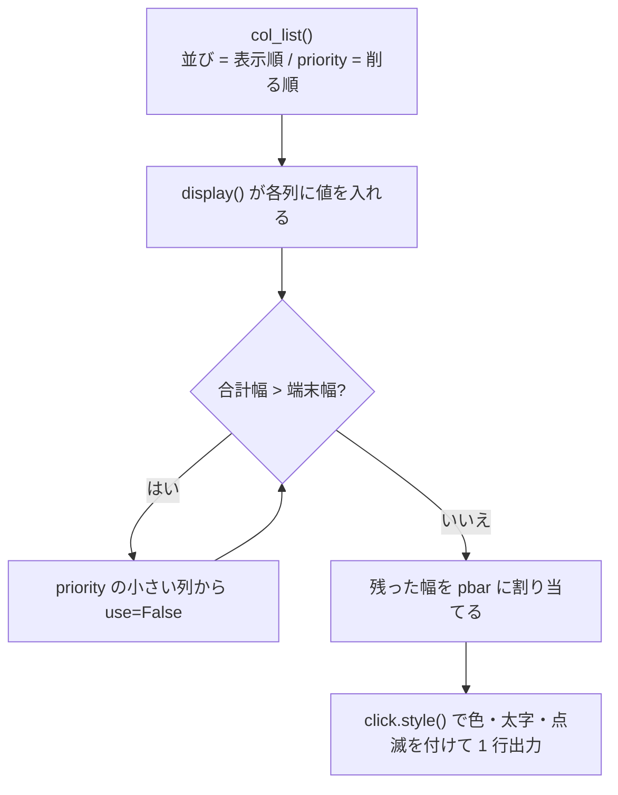

# tmr の内部構造

手を入れる人向けの説明。
使い方は [docs/User.md](User.md) にあります。


## == 開発環境

普段の確認は `uv run` で足ります。

```bash
uv run pytest tests                        # テストだけ流す（最速）
uv run tmr timer 1                         # 手元で動かす（1 分）
uv run tmr pomodoro -w 0.1 -b 0.1 -c 2     # ポモドーロを短時間で確認
```

lint はこの 4 本です。

```bash
uv run ruff format --line-length 78 src tests
uv run ruff check --fix --extend-select I src tests
uv run basedpyright src tests
uv run mypy src tests
```

**行長は 78 文字**。`pyproject.toml` ではなく `mise.toml` の引数で
指定しています。

`mise` のタスクは `build` → `test` → `lint` → `upgradeproject` と
`depends` でつながっています。**`mise run test` や `mise run lint` を
呼ぶと `upgradeproject` が動き、`uv.lock` を削除して `uv sync` を
やり直します。** 普段は上の `uv run` を使い、`mise run` は
リリース前など意図があるときだけにしてください。


## == モジュール構成



| ファイル | 役割 |
|---|---|
| `cli.py` | `click` のコマンド定義。オプションの検証と秒への換算 |
| `config.py` | 設定ファイルを読んで `default_map` を作る `ConfigGroup` |
| `timer.py` | `Timer`（メインループ、キー操作、アラーム）と `AlarmParams` |
| `clock.py` | `TimerClock`。経過時間だけを持つ |
| `view.py` | `TimerView`（列の定義・省略・スタイル）と `TimerTitle` |
| `progress_bar.py` | `ProgressBar`。バーの文字列を作る |
| `pomodoro.py` | `PomodoroTimer`、`PomodoroConfig`、`phases()` |
| `terminal.py` | `TerminalContext` とエスケープシーケンスの定数 |
| `timefmt.py` | 時間の単位と `t_str()` |
| `mylog.py` | `loguru` に名前と水準を足す薄い層 |
| `click_utils.py` | 全コマンド共通のオプション（`-V` / `-d` / `-h`） |


## == なぜ 3 つに分けたか

もとは `Timer` 1 クラスに全部が入っていました。今は 3 つです。

- `TimerClock` — 経過時間。**端末に触らないので単体で試せる**。
  早送り・ポーズのテストに `blessed` が要りません
- `TimerView` — 列の定義、幅に応じた省略、スタイル付け。
  「何を出すか」を変えたいときはここだけ見ればよい
- `Timer` — メインループとキー操作・アラーム。`Terminal` を作り、
  上の 2 つを持つ

分ける前は、表示の桁を直したいときでも、キー入力の処理を読まなければ
なりませんでした。テストも `Terminal` のモックなしには何も書けません
でした。


## == `PomodoroTimer` が `Timer` を継承しない理由

`PomodoroTimer` は `Timer` の**使い手**であって、「特殊な `Timer`」では
ないからです。

ポモドーロがやることは、`phases()` が返すフェーズを順に取り出し、
そのたびに `Timer` を作って `main()` を呼ぶ、それだけです。
`Timer` のメインループもキー操作も上書きしません。
継承すると「どのメソッドを上書きしてよいか」という制約が増えるだけで、
得るものがありません。

`phases()` はジェネレータで、**フェーズを無限に返します**。
`cycles` は「長い休憩までの作業回数」という 1 巡の長さで、
巡回そのものは終わりません。終わらせるのは `run()` 側の判断です。


## == メインループとフェーズ制御

`Timer.main()` は `term.cbreak()` の中で `inkey(timeout=0.2)` を
回します。**この 0.2 秒がそのまま画面の更新間隔**です。



サイクル全体を止めるかどうかは、`main()` の**戻り値 1 つ**で決まります。



`main()` が `True` を返すのは、**quit コマンドで終わったときだけ**です。
`next` はタイマーを終わらせますが `True` を返しません。
**この 1 点だけがポモドーロの制御経路**です。

`next` は `enable_next=True` のときしか効きません
（`PomodoroTimer._run_timer()` がこれを渡します）。
`fn_help()` も `enable_next` を見て、単純タイマーでは `Next` の行を
出しません。


## == 表示の決まり方

`TimerView.col_list()` が返すリストが表示のすべてを決めます。

- **リストの並び順が、そのまま画面上の並び順**
- 各 `TimerCol` の **`priority` が、幅の足りないときに削る順**
  （小さいものから削られる）



現在の定義:

| 表示順 | name | priority | 中身 |
|---|---|---|---|
| 1 | `date` | 1 | `2026-09-08` |
| 2 | `time` | 2 | `14:03:21` |
| 3 | `title` | 8 | `-t` で指定したタイトル（太字） |
| 4 | `limit` | 5 | 設定時間 `25m` |
| 5 | `state` | 7 | `[PAUSE]` / `[TIME UP]`。それ以外は空 |
| 6 | `rate` | 4 | ` 42.0%` |
| 7 | `elapsed` | 3 | 経過 `10m30s` |
| 8 | `pbar` | 6 | プログレスバー（残った幅を全部使う） |
| 9 | `remain` | 9 | 残り `14m30s` |

`pbar` は幅の計算中だけ `PBAR_LEN_MIN`（10 文字）分の仮の値を持ち、
残す列が決まってから実際の長さで作り直します。
削った結果 1 つも残らなければ `!?` だけを点滅表示します。

`rate_color=True` の列は経過率で色が変わり（`PERCENT_COLOR`）、
`pause_blink=True` の列はポーズ中に点滅します。

**表示項目を足すときは、`col_list()` に 1 行足し、`display()` で
その列に値を入れます。**`title` のように `__init__` で値が決まる
ものは `display()` に足す必要がありません。


## == 時刻の扱い

- 時刻は `time.monotonic()`。NTP でシステム時刻が動いても狂いません
- **早送り・巻き戻し・ポーズは `TimerClock.t_start` をずらして
  表現します**（`elapsed` を直接いじらない）。
  ポーズ中は `t_start = t_cur - elapsed` を毎周回し直すことで、
  経過時間を止めます
- 秒数を `"1h01m01s"` のような文字列にする `t_str()` と、
  時間の単位（`SEC_MIN` / `MIN_HOUR`）は `timefmt.py` にあります


## == 値の検証

0 以下・`nan`・`inf` の時間やサイクル数は、二重に弾いています。

- CLI では `click.IntRange` / `click.FloatRange` と、
  `nan` / `inf` を弾くコールバック
- `TimerClock` / `PomodoroConfig` / `AlarmParams` の `ValueError`

`Timer` や `PomodoroTimer` をライブラリとして直接使う経路は CLI を
通らないので、両方が要ります。

**ただしアラームの回数と間隔は 0 を許します**（鳴らさない／間を
空けない）。間隔の上限は 1 日（`timefmt.SEC_DAY`）で、
`time.sleep()` が `OverflowError` にならないようにするためです。

アラームのコマンド（`--alarm-cmd`）も同じ二重の作りです。空文字・
空白のみは、CLI では `_reject_empty` コールバックが usage error に
（終了コード 2。設定ファイル経由でも同じ）、`AlarmParams` では
`ValueError` にします。指定したのに何も起きないのは分かりにくいためです。


## == ログ

`loguru` のグローバル logger を、`mylog.getLogger()` で名前を付けて
使います。詳しい使い方は `mylog.py` の docstring にあります。

クラスのあるモジュールでは、**クラス本体に**
`__log = getLogger(__qualname__)`（アンダースコア 2 つ）を 1 つ置き、
メソッドからは `self.__log.debug(...)` と呼びます。

- `__qualname__` はクラス本体の実行前に暗黙で入る変数で、クラス名が
  そのまま入ります。クラス名を手で書かずに済み、改名してもずれません
- アンダースコア 2 つなら名前修飾で `self._Timer__log` に解決されるので、
  子クラスのインスタンスから親のメソッドを呼んでも親の名前で出ます。
  `_log`（1 つ）だと MRO で子クラスの定義が勝ち、親のログが子の水準で
  出てしまいます
- `__init__` の中で `self.__log = ...` はしません。クラス本体に置けば、
  `super().__init__()` を呼び忘れても `AttributeError` にならず、
  `classmethod` からも使え、インスタンスを作る前から水準が効きます

クラスの無いモジュール（`cli.py`）は、モジュール先頭に
`_log = getLogger("main")` を置きます。

水準は、普段はクラス本体の `getLogger(name, level)` で指定します。
テストや実行中など外から変えるときだけ `setLevel(name, level)` を
使い、既定に戻すには `setLevel(name)` を呼びます。

各 CLI コマンドの先頭で `loggerInit(debug)` を 1 度だけ呼びます。
`debug` が決めるのは、名前を指定していないログの既定水準
（`DEBUG` / `INFO`）だけです。`getLogger()` / `setLevel()` で
指定した名前ごとの水準は、呼ぶ順に関わらず `loggerInit()` で
上書きされません。


## == 端末の後始末

`TerminalContext`（`terminal.py`）が、**カーソルの復帰と
`KeyboardInterrupt` の握り潰し**を担当します。
端末を触る処理は必ずこの `with` の中に置いてください。
`cli.py` の各コマンドがこれで包んでいます。

アラームは daemon スレッドで `\a` を鳴らします。停止の合図は
`alarm_active` フラグ 1 つで、スレッド側もメインループ側も見ています。

### === アラームのコマンド（`AlarmParams.cmd`）

`AlarmParams.cmd` を指定したときは、ベルの代わりに
`subprocess.Popen(cmd, shell=True)` を**満了時に 1 回だけ**実行します
（`exec_alarm_cmd()`）。終わりを待つのはアラームのスレッドなので、
キー入力と再描画をするアラームの待ちループは止まりません。
ただし**キーを押したあとの後始末では待ちます**（下記）。

**コマンドが自然に終わっても `alarm_active` は False にしません。**
キーを押すまでアラームの状態を続け、ベルのときと体感を揃えるためです
（ポモドーロも、キーを押すまで次のフェーズへ進みません）。
つまり cmd の経路では、止まる条件は**キー入力だけ**になります。

キーでアラームを抜けたら、`stop_alarm_cmd()` が**まだ動いている
コマンドを止めてから** `main()` を返します。止めないと、コマンドが
終わるまで `main()` が返らず「`[Q]` が効かない」ように見えます。

- `shell=True` なのでシグナルの相手はシェルです。シェルだけ落とすと
  孫（`sleep` など）が残り、`stdout` のパイプを握ったままになるので、
  `start_new_session=True` で新しいセッションにしておき、
  **プロセスグループごと** `os.killpg()` します
- `SIGTERM` → `ALARM_STOP_SEC`（1 秒）待つ → 止まらなければ `SIGKILL`。
  それでも止まらなければ警告を出し、`join()` せずに進みます
  （固まらせないため）。`ALARM_STOP_SEC` は 3 か所（起動待ち・
  `SIGTERM` の後・`SIGKILL` の後）で効くので、**最悪 3 秒**待ってから
  `main()` が返ります
- スレッドが `Popen` を作り終える前にキーが押されると止めそこねるので、
  `alarm_proc_ready`（`threading.Event`）で起動を待ってから止めます
- シグナルを送る前に `proc.poll() is None` を確かめます。回収済みの
  pid は OS が再利用しうるので、無関係なプロセスグループを撃たない
  ためです（`Popen.send_signal()` が同じ確認をしていますが、あちらは
  シェル 1 つにしか届かないので使えません）
- `Ctrl-C` でも子は残しません。`start_new_session=True` の子は別
  セッションなので、端末が送る `SIGINT` は tmr にしか届きません。
  `main()` が `KeyboardInterrupt` を捕まえて `stop_alarm_cmd()` を
  通してから送出し直します（握り潰す `TerminalContext` へ渡す前に）
- **後始末の間は `SIGINT` を止めます**（`cleanup_by_interrupt()`）。
  最悪 3 秒かかるので、その間に 2 度目の `Ctrl-C` を押されると
  `SIGKILL` の前に抜けてしまい、`SIGTERM` を無視するコマンドが
  残るためです（実測で残った）。あわせて、**アラームのスレッドは
  `SIGINT` を止めた状態で起動します**（`ring_alarm()`）。
  スレッドは生成時のマスクを継ぐので、こうしないと `SIGINT` を
  スレッドが受け取り、メインスレッドのマスクを素通りして
  `KeyboardInterrupt` が飛びます（これも実測）。戻すときは解除ではなく
  **元のマスクへ戻します**（`SIG_SETMASK`）。呼ぶ側が `SIGINT` を
  止めていることがあるためです
- その副作用で、**アラームのコマンド自身も `SIGINT` を止めた状態で
  起動します**（`Popen` をそのスレッドから呼ぶので、子がマスクを継ぐ）。
  tmr はコマンドを `SIGTERM` / `SIGKILL` で止めるので停止手順には
  影響せず、そのままにしています
- `main()` の冒頭で `alarm_proc` / `alarm_proc_ready` /
  `alarm_cmd_stopped` / `alarm_thr` を初期化します。同じ `Timer` で
  2 回目を回したときに、前回の proc を見て止めそこねないためです
  （ポモドーロはフェーズごとに作り直しますが、ライブラリとして
  直接使う経路があります）

**止められない書き方もあります**（直していません）。シェルが `&` で
残した孫がパイプを握っていると、シェルだけ終わっているので
`stop_alarm_cmd()` は「止める必要なし」と判断し、`communicate()` が
返らないまま `join()` で待ちます。出力の多いコマンド（`yes` など）を
指定すると `communicate()` がメモリを食い尽くします。どちらも
「変なコマンドを書いた側の責任」として、`docs/User.md` に注意を
書くだけにしました。

子プロセスの `stdin` は `DEVNULL`、`stdout` / `stderr` は
`PIPE` で取り込んでログに回します（長さは `LOG_MAX_LEN` で
切り詰めます）。端末をそのまま渡すと、
出力が再描画に混ざって画面が崩れ、打鍵も取り合いになるためです。

失敗しても（コマンドが無い、非ゼロ終了）ログに残して続け、
ベルにはフォールバックしません。自分で止めたときの負の
`returncode` は失敗として扱いません（`alarm_cmd_stopped`）。


## == 設定ファイルの読み込み

`config.py` が `~/.config/tmr/config.toml`（`XDG_CONFIG_HOME` が
あればその下）を読み、`click` の `default_map` を作ります。
優先順位 **コマンドライン引数 > 設定ファイル > コードの既定値** は
`click` 側が面倒を見るので、各コマンドの定義には手を入れていません。

`cli` は `ConfigGroup`（`click.Group` の子）で、`make_context()` の
中で設定を読みます。**サブコマンドを直接 `invoke()` しても設定は
読まれません。** 設定を絡めたテストは `cli` から呼び、
`XDG_CONFIG_HOME` を `tmp_path` に向けてください
（`tests/test_config.py` 参照）。

`default_map` は別名にも同じ dict を張るので、`tmr t` でも `[timer]`
が効きます。

`config.py` は `loggerInit()` より前に動くので**ログを出しません**
（`loguru` の既定ハンドラに素通しされ、毎回出てしまうため）。
読んだ結果は `cli` の中で `ctx.default_map` として出します。


## == テスト

`unittest.mock.patch` で差し替えるのが基本形です。
**モジュールごとに patch する先が違う**ので注意してください。

| テスト | patch する先 |
|---|---|
| `tests/test_timer.py` | `tmr.timer` の `Terminal` / `TimerView` / `click` / `time`（アラームの sleep）/ `subprocess`（アラームのコマンド）、`tmr.clock` の `time`（経過時間） |
| `tests/test_view.py` | `tmr.view` の `ProgressBar` / `click`。`Terminal` は `MagicMock` を渡す |
| `tests/test_clock.py` | `tmr.clock` の `time` だけ（端末に依存しない） |

CLI は `click.testing.CliRunner` と `Timer` のモックで試します
（`tests/test_cli.py`）。スレッドが絡む部分だけ実物を動かす
統合テストが `tests/test_integration_alarm.py` にあります。

`Terminal` をモックするときは、**`term.width` に数値を入れて
ください**（`TimerView.display()` が幅と比較するので、`MagicMock`
のままだと落ちます）。

`tests/conftest.py` が **`tmr.timer` の `os.killpg` を常に塞いで
います**（autouse）。モックの `pid` をそのまま渡すと、開発機の
無関係なプロセスグループへシグナルを撃ちうるためです。呼び出しを
見たいテストは `tests/test_timer.py` の `mock_killpg` を使います
（内側で patch し直します）。

`Ctrl-C` の後始末は自動テストでは端末が要るので、`Timer.main()` に
`KeyboardInterrupt` を投げるモックで代用しています
（`test_main_keyboard_interrupt_stops_alarm_cmd`）。実機での手順は
`archives/agents/TODO-016/implementer-report.md` にあります。


## == バージョン

`hatch-vcs` で git タグから決まります。`__init__.py` は
`importlib.metadata.version()` で読み、未インストールなら `"0.0.0"`
です。**ソースに版番号を書かないでください。**
